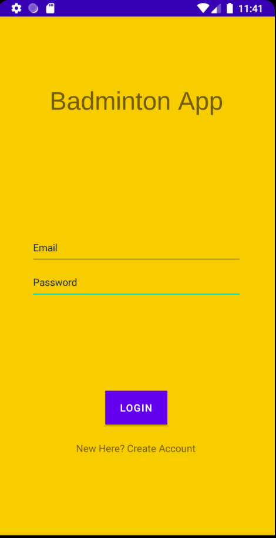
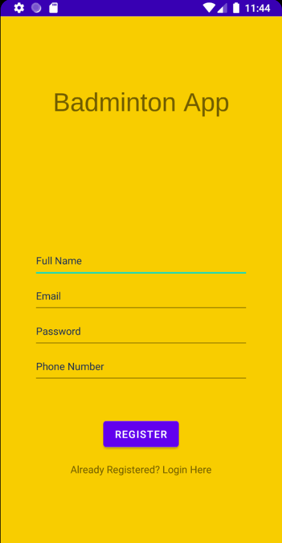
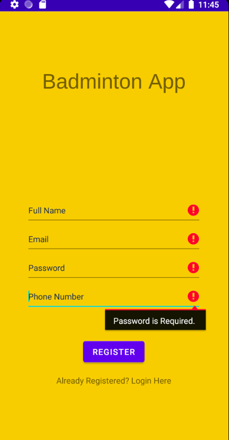
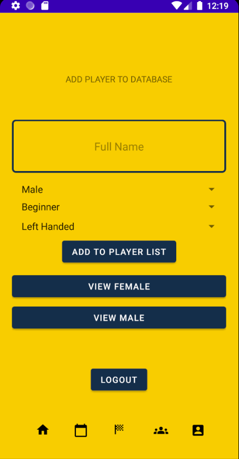
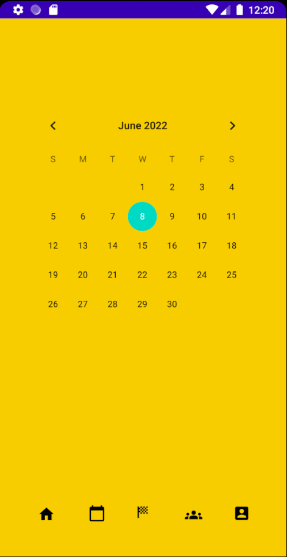
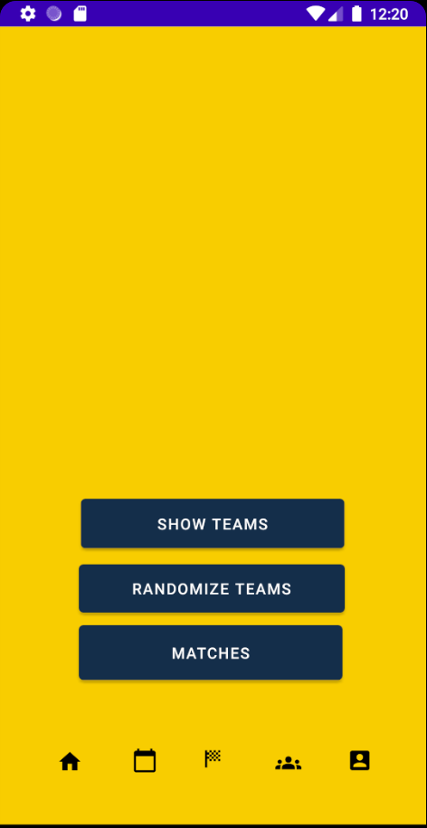
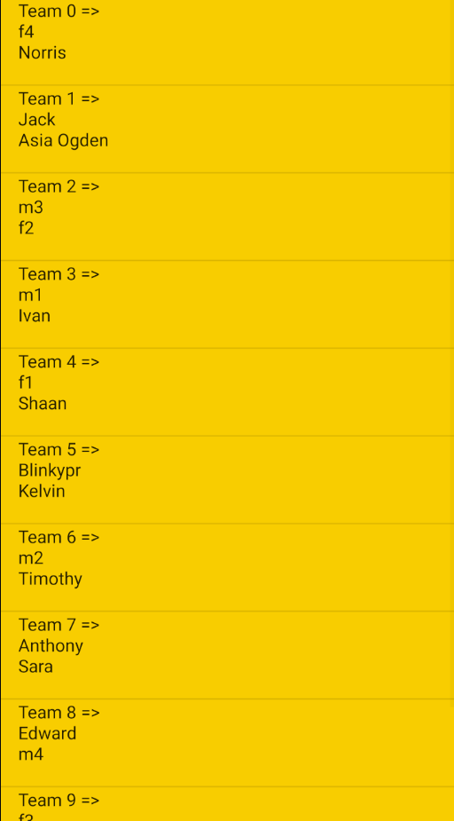
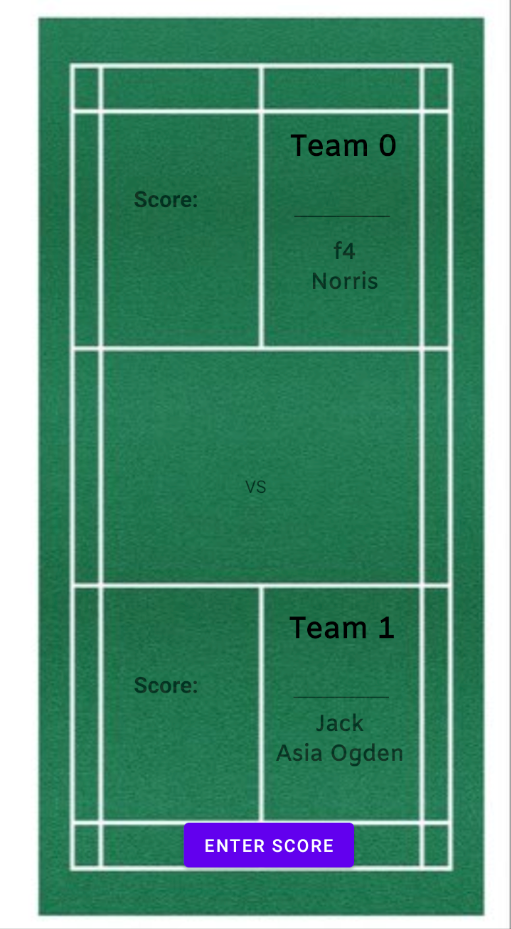

# Badminton Team Sorter

### Table of Contents

1. [Introduction](#Introduction)
2. [Description](#Description)
3. [How to run the application](#How-to-run-the-application)
4. [Signing up and signing in](#Signing-up-and-signing-in)
5. [Front Page](#Front-Page)
6. [Calendar](#Calendar)
7. [Match Creation](#Match-creation)
8. [Group](#Group)
9. [Profile](#Profile)

## Introduction

This repository contains code for the badminton team sorter from my personal Final year university
project.

#### Description

This is an android studios project that is written in Java. It uses SQLite to store all the data internally
on the phone. The app is designed to help clubs sort out games for their sessions so that it is more
fair on the people that are playing so that there are not those that play too much and those that
play too few. This app is also able to balance the teams so that there isn't too much of a strength
difference between the teams. The strengths of each of the players are determined in an Elo like system
that can be found quite commonly in chess and computer games where there is a ranking involved. 

## How to run the application

Loading your Andriod Studios there will be a play button on the top right-hand side. A phone will be selected to run the
application, in some cases the phone will not be downloaded to run the application. In the examples shown it will be 
done on the Google Pixel 3 XL phone. The phone will need to be downloaded on to your Android Studios. 

Once this is done, the application will be downloaded on to the phone that you have decided to run the application on.
Find the application and start it as if it is a normal application on your own phone for applications.

## Signing up and signing in

On the front screen when coming into the application you should see this screen with Badminton App. Here are you are able
to se some fields where you are able to enter in details for your login. However, before that can happen you must first 
sign up. 

Once on the sign-up page, there are 4 fields that will be needed to be complete. Each of the fields will have a certain 
way in order to have a successful registration e.g Email will have to be in proper email format or password has to be a 
certain length for it to be valid.

 

If not filled in correctly there will be warning signs to show that there are some
problems with how it was fill out. After a successful registration you will automatically log into the application.

## Front Page

Since this is a club application designed for badminton clubs. There are going to be some members in the database as there
are already existing members. This can be increase by adding the players by filling out the different fields that can be 
selected for the member that is joining. All the fields will have to be filled, Full name, gender, standards or play and 
left or right-handed. Once all of this has been completed they will be added into the database where it can be viewed on
that page. 

## Calender

In this page, it is currently under-development. The plan for this page is so that there are events that can be added to
the calendar so that different members of the app is able to see what days there are events such as a match day or club
events where people can decide if they would like to go. In the future, it can also add attendance of the people that are 
joining the session for that day which would allow it to be more interactive with the members of the club. The more people
that attend the session more people are more likely to join the session. 

## Match Creation

Each of the people that are in the club are all assigned a rating, this is also called Elo Rating which is commonly found
in Chess or computer games. When a match is created, it is a random selection of who is each team. The matches will be 
displayed in the tab. Inside you are able to access all of the games that are currently being played. The results can be
entered into the match and this will automatically update the Elo ratings of the people that are in the match that the 
result has been entered for. 

## Group

Here you are able to access everyone that is in the club to view each and every person's detail clearly.

## Profile

On this page you are able to see that there is a profile picture that can be added to show yourr acocunt details and to be
personalised to your liking in terms of the profile picture.

